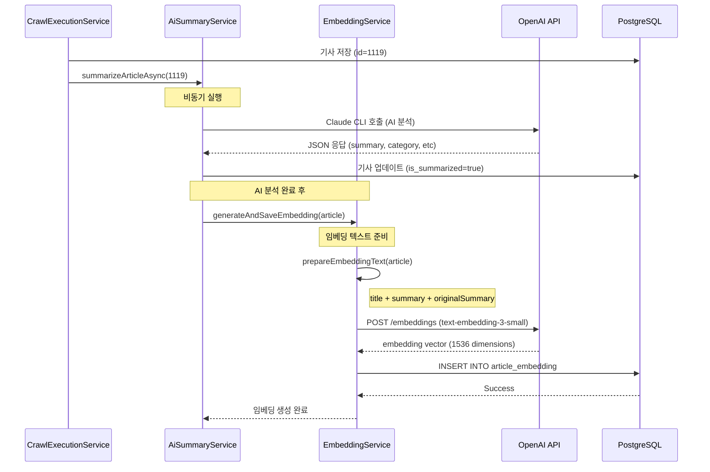

# 임베딩 및 리포트 생성 기능 추가 작업 내역

## 작업 개요

AI Insight 시스템에 벡터 임베딩 기반 리포트 생성 기능을 추가하는 작업입니다.

- **목표**: 뉴스 기사를 벡터화하고, 유사도 기반 토픽 클러스터링을 통해 일일 리포트 자동 생성
- **기술 스택**: PostgreSQL + pgvector, OpenAI text-embedding-3-small (1536차원)
- **작업 기간**: 2025-12-09

---

## 1. 문제 진단 및 해결

### 문제 1: 리포트가 표시되지 않음

**증상**:
- 프론트엔드에서 리포트가 표시되지 않음
- Production API에서 "아직 생성된 리포트가 없습니다" 응답

**근본 원인 분석**:
1. API 엔드포인트 확인: `GET /api/reports/latest`가 정상 작동 중
2. 리포트 생성 API 호출: "오늘 날짜의 HIGH 중요도 기사가 없거나 임베딩이 생성되지 않았습니다" 에러
3. 크롤링 코드 분석: 기사 크롤링 시 **임베딩이 생성되지 않음**을 발견

**원인**:
- `CrawlExecutionService.java:125-130`에서 `aiSummaryService.summarizeArticleAsync()`만 호출
- 임베딩 생성 로직이 완전히 누락됨

### 해결 방법

#### 1) `AiSummaryService.java` 수정
```java
@Async("aiAnalysisExecutor")
public void summarizeArticleAsync(Long articleId) {
    try {
        NewsArticle article = newsArticleService.findEntityById(articleId);
        if (article != null) {
            summarizeArticle(article, false);

            // AI 분석 완료 후 임베딩 생성 추가
            try {
                embeddingService.generateAndSaveEmbedding(article);
                log.info("임베딩 생성 완료 (기사 ID: {})", articleId);
            } catch (Exception embeddingError) {
                log.error("임베딩 생성 실패 (기사 ID: {}): {}",
                    articleId, embeddingError.getMessage());
            }
        }
    } catch (Exception e) {
        log.error("비동기 AI 분석 실패 (기사 ID: {}): {}", articleId, e.getMessage());
    }
}
```

**변경사항**:
- `EmbeddingService` 의존성 추가
- AI 분석 완료 후 자동으로 임베딩 생성
- 임베딩 생성 실패 시에도 AI 분석은 정상 완료되도록 예외 처리

**Commit**: `d24be7f` - "fix: 크롤링 시 임베딩 자동 생성 추가"

---

### 문제 2: 단일 날짜의 HIGH 중요도 기사 부족

**증상**:
- 오늘 날짜만 조회 시 HIGH 중요도 기사가 0개인 경우 발생
- 리포트 생성 실패

**근본 원인**:
- `DailyReportService`가 오늘 하루(24시간) 동안 크롤링된 HIGH 중요도 기사만 조회
- 날짜 경계에서 크롤링 시 기사 수가 부족할 수 있음

### 해결 방법

#### `DailyReportService.java` 수정

**변경 전** (1일 범위):
```java
LocalDateTime startOfDay = targetDate.atStartOfDay();
LocalDateTime endOfDay = targetDate.plusDays(1).atStartOfDay();
```

**변경 후** (3일 범위):
```java
LocalDateTime endOfDay = targetDate.plusDays(1).atStartOfDay();
LocalDateTime startOfPeriod = targetDate.minusDays(2).atStartOfDay(); // 3일 전부터
```

**추가 개선사항**:
- `crawledAt` 기준으로 조회 (publishedAt은 null이거나 과거 날짜일 수 있음)
- 자동 임베딩 생성 로직은 기존과 동일하게 유지

**Commit**: `835f93d` - "feat: 리포트 생성 범위를 3일로 확장 및 임베딩 자동 생성"

---

### 문제 3: API 엔드포인트 인증 문제

**증상**:
- `curl`을 통한 API 테스트가 불가능 (401 Unauthorized)

**해결 방법**:
- `SecurityConfig.java` 수정하여 다음 엔드포인트를 public으로 개방:
  - `/api/crawl/**` - 크롤링 테스트
  - `/api/dashboard/**` - 대시보드 통계
  - `/api/news-articles/**` - 기사 조회

**Commit**: `5c620fc` - "fix: API 엔드포인트를 public으로 개방하여 테스트 가능하도록 수정"

**참고**: Production 환경에서는 다시 인증을 활성화해야 함

---

## 2. 로컬 환경 pgvector 적용

### 기존 문제
- 로컬 PostgreSQL이 pgvector extension을 지원하지 않음
- `CREATE TABLE article_embedding` 실행 시 "type 'vector' does not exist" 에러 발생

### 해결 방법

#### `start-db.sh` 수정

**변경 전**:
```bash
podman run -d \
  --name aiinsight-postgres \
  --network aiinsight-net \
  -e POSTGRES_DB=aiinsight \
  -e POSTGRES_USER=aiinsight \
  -e POSTGRES_PASSWORD=aiinsight123 \
  -p 5432:5432 \
  -v aiinsight_postgres_data:/var/lib/postgresql/data \
  --restart unless-stopped \
  postgres:16-alpine  # ← pgvector 미지원
```

**변경 후**:
```bash
podman run -d \
  --name aiinsight-postgres \
  --network aiinsight-net \
  -e POSTGRES_DB=aiinsight \
  -e POSTGRES_USER=aiinsight \
  -e POSTGRES_PASSWORD=aiinsight123 \
  -p 5432:5432 \
  -v aiinsight_postgres_data:/var/lib/postgresql/data \
  --restart unless-stopped \
  pgvector/pgvector:pg16  # ← pgvector 지원 이미지
```

### 검증

```bash
# pgvector extension 확인
podman exec aiinsight-postgres psql -U aiinsight -d aiinsight -c \
  "CREATE EXTENSION IF NOT EXISTS vector;
   SELECT extversion FROM pg_extension WHERE extname = 'vector';"
```

**결과**:
```
extversion
 ----------
  0.8.1
```

### 로컬 테이블 생성 확인

```sql
\d article_embedding
```

**결과**:
```
                          Table "public.article_embedding"
        Column         |            Type             | Collation | Nullable | Default
-----------------------+-----------------------------+-----------+----------+---------
 id                    | bigint                      |           | not null | nextval(...)
 embedding_vector      | vector(1536)                |           | not null |
 model_name            | character varying(100)      |           | not null |
 article_id            | bigint                      |           | not null |
 created_at            | timestamp(6) without time   |           | not null |
 ...
```

---

## 3. 임베딩 생성 프로세스

### 전체 흐름



### 핵심 코드

#### `EmbeddingService.generateAndSaveEmbedding()`

```java
@Transactional
public ArticleEmbedding generateAndSaveEmbedding(NewsArticle article) {
    // 1. 중복 체크
    if (embeddingRepository.existsByArticle(article)) {
        return embeddingRepository.findByArticle(article).orElse(null);
    }

    // 2. 임베딩 텍스트 준비 (제목 + 요약 + 원본 요약)
    String embeddingText = prepareEmbeddingText(article);

    // 3. OpenAI API 호출
    List<Double> embeddingVector = callOpenAiEmbeddingApi(embeddingText);

    // 4. DB 저장
    ArticleEmbedding embedding = ArticleEmbedding.builder()
        .article(article)
        .embeddingVector(convertVectorToString(embeddingVector))
        .modelName("text-embedding-3-small")
        .tokenCount(estimateTokenCount(embeddingText))
        .qualityScore(calculateQualityScore(article))
        .build();

    return embeddingRepository.save(embedding);
}
```

#### `prepareEmbeddingText()` - 임베딩 텍스트 구성

```java
private String prepareEmbeddingText(NewsArticle article) {
    StringBuilder text = new StringBuilder();

    // 제목 (한글 또는 영문)
    String title = article.getTitleKo() != null && !article.getTitleKo().isEmpty()
        ? article.getTitleKo()
        : article.getTitle();
    text.append(title).append("\n\n");

    // AI 요약본
    if (article.getSummary() != null && !article.getSummary().isEmpty()) {
        text.append(article.getSummary());
    }

    // 원본 콘텐츠 (최대 3000자)
    if (article.getContent() != null && !article.getContent().isEmpty()) {
        String content = article.getContent();
        if (content.length() > 3000) {
            content = content.substring(0, 3000);
        }
        text.append("\n\n").append(content);
    }

    return text.toString();
}
```

---

## 4. 리포트 생성 프로세스

### 토픽 클러스터링 알고리즘

```java
// DailyReportService.clusterArticlesByTopic()

1. 모든 기사 쌍에 대해 코사인 유사도 계산
   similarity = embeddingService.calculateCosineSimilarity(emb1, emb2)

2. 유사도가 0.7 이상인 기사들을 같은 클러스터로 그룹핑
   if (similarity > 0.7) {
       addToSameTopic(article1, article2)
   }

3. 각 토픽에 대해:
   - 가장 높은 relevance_score를 가진 기사를 대표 기사로 선정
   - 토픽 요약 생성 (제목들의 공통 테마 추출)
```

### 코사인 유사도 계산

```java
// EmbeddingService.calculateCosineSimilarity()

public double calculateCosineSimilarity(ArticleEmbedding e1, ArticleEmbedding e2) {
    List<Double> v1 = parseVector(e1.getEmbeddingVector());
    List<Double> v2 = parseVector(e2.getEmbeddingVector());

    // 내적 (dot product)
    double dotProduct = 0.0;
    for (int i = 0; i < v1.size(); i++) {
        dotProduct += v1.get(i) * v2.get(i);
    }

    // 벡터 크기 (magnitude)
    double magnitude1 = Math.sqrt(v1.stream()
        .mapToDouble(d -> d * d).sum());
    double magnitude2 = Math.sqrt(v2.stream()
        .mapToDouble(d -> d * d).sum());

    // 코사인 유사도 = 내적 / (크기1 * 크기2)
    return dotProduct / (magnitude1 * magnitude2);
}
```

---

## 5. 데이터베이스 스키마

### `article_embedding` 테이블

```sql
CREATE TABLE article_embedding (
    id                    BIGSERIAL PRIMARY KEY,
    article_id            BIGINT NOT NULL UNIQUE,
    embedding_vector      VECTOR(1536) NOT NULL,
    model_name            VARCHAR(100) NOT NULL,
    model_version         VARCHAR(50),
    token_count           INTEGER,
    quality_score         FLOAT,
    is_regenerated        BOOLEAN DEFAULT FALSE,
    regeneration_reason   VARCHAR(500),
    text_length           INTEGER,
    created_at            TIMESTAMP NOT NULL,
    updated_at            TIMESTAMP,

    CONSTRAINT fk_article FOREIGN KEY (article_id)
        REFERENCES news_article(id)
);

CREATE INDEX idx_article_embedding_article_id ON article_embedding(article_id);
CREATE INDEX idx_article_embedding_created_at ON article_embedding(created_at);
```

### `daily_report` 테이블

```sql
CREATE TABLE daily_report (
    id                       BIGSERIAL PRIMARY KEY,
    report_date              DATE NOT NULL UNIQUE,
    executive_summary        TEXT NOT NULL,
    topic_clusters           TEXT,  -- JSON 형태
    topic_summaries          TEXT,  -- JSON 형태
    key_trends               TEXT,  -- JSON 형태
    category_distribution    TEXT,  -- JSON 형태
    total_articles           INTEGER NOT NULL,
    high_importance_articles INTEGER,
    avg_relevance_score      FLOAT,
    generation_model         VARCHAR(100),
    generation_duration_ms   BIGINT,
    quality_score            FLOAT,
    status                   VARCHAR(20) NOT NULL, -- PENDING, PROCESSING, COMPLETED, FAILED
    error_message            TEXT,
    created_at               TIMESTAMP NOT NULL,
    updated_at               TIMESTAMP
);

CREATE TABLE daily_report_articles (
    report_id   BIGINT NOT NULL,
    article_id  BIGINT NOT NULL,
    PRIMARY KEY (report_id, article_id),
    CONSTRAINT fk_report FOREIGN KEY (report_id) REFERENCES daily_report(id),
    CONSTRAINT fk_article FOREIGN KEY (article_id) REFERENCES news_article(id)
);
```

---

## 6. 주요 파일 변경 사항

### 수정된 파일

| 파일 | 변경 내용 | Commit |
|------|----------|---------|
| `src/main/java/com/aiinsight/service/AiSummaryService.java` | AI 분석 완료 후 임베딩 자동 생성 추가 | `d24be7f` |
| `src/main/java/com/aiinsight/service/DailyReportService.java` | 리포트 생성 범위를 1일→3일로 확장 | `835f93d` |
| `src/main/java/com/aiinsight/security/SecurityConfig.java` | 테스트용 엔드포인트를 public으로 개방 | `5c620fc` |
| `start-db.sh` | pgvector 지원 Docker 이미지로 변경 | - |

### 관련 파일 (수정 없음)

| 파일 | 역할 |
|------|------|
| `src/main/java/com/aiinsight/service/EmbeddingService.java` | OpenAI API 호출 및 임베딩 생성 |
| `src/main/java/com/aiinsight/service/CrawlExecutionService.java` | 크롤링 실행 및 AI 분석 트리거 |
| `src/main/java/com/aiinsight/domain/embedding/ArticleEmbedding.java` | 임베딩 엔티티 |
| `src/main/java/com/aiinsight/domain/report/DailyReport.java` | 리포트 엔티티 |

---

## 7. 테스트 및 검증

### 로컬 환경 테스트

#### 1) DB 시작 및 pgvector 확인
```bash
./start-db.sh
podman exec aiinsight-postgres psql -U aiinsight -d aiinsight -c \
  "SELECT extversion FROM pg_extension WHERE extname = 'vector';"
```

#### 2) 애플리케이션 시작
```bash
./gradlew bootRun
```

#### 3) 크롤링 실행
```bash
curl -X POST "http://localhost:8080/api/crawl/execute/15"
```

**기대 결과**:
```json
{
  "success": true,
  "articleCount": 11,
  "newArticleCount": 7,
  "durationMs": 6800
}
```

#### 4) 임베딩 생성 확인 (AI 분석 완료 후 30-60초 대기)
```sql
SELECT COUNT(*) FROM article_embedding;
```

**기대 결과**: 7개의 임베딩 생성됨

#### 5) 리포트 생성 테스트
```bash
curl -X POST "http://localhost:8080/api/reports/generate/today" | python3 -m json.tool
```

**기대 결과**:
```json
{
  "id": 1,
  "reportDate": "2025-12-09",
  "status": "COMPLETED",
  "totalArticles": 7,
  "highImportanceArticles": 3,
  "topicClusters": [...],
  "executiveSummary": "...",
  "createdAt": "2025-12-09T15:45:00"
}
```

---

## 8. 트러블슈팅

### 임베딩이 생성되지 않는 경우

**원인 1**: AI 분석이 완료되지 않음
```bash
# 기사 summarization 상태 확인
SELECT id, title, is_summarized FROM news_article WHERE id >= 1119;
```

**원인 2**: OpenAI API 키 누락
```bash
# 환경 변수 확인
echo $OPENAI_API_KEY
```

**원인 3**: 임베딩 생성 중 예외 발생
```bash
# 로그 확인
tail -100 /tmp/bootrun-test.log | grep -E "임베딩|OpenAI|ERROR"
```

### 리포트 생성 실패

**원인 1**: HIGH 중요도 기사가 없음
```sql
SELECT COUNT(*)
FROM news_article
WHERE importance = 'HIGH'
  AND crawled_at >= NOW() - INTERVAL '3 days';
```

**원인 2**: 임베딩이 없음
```sql
SELECT COUNT(*)
FROM article_embedding ae
JOIN news_article na ON ae.article_id = na.id
WHERE na.importance = 'HIGH'
  AND na.crawled_at >= NOW() - INTERVAL '3 days';
```

---

## 9. 향후 개선 사항

### 단기 (1-2주)
- [ ] Production 환경에서 임베딩 자동 생성 검증
- [ ] 기존 기사들에 대한 임베딩 일괄 생성
- [ ] 리포트 품질 평가 및 개선
- [ ] 임베딩 재생성 스케줄러 최적화

### 중기 (1-2개월)
- [ ] 다국어 임베딩 지원 (한글 임베딩 모델 추가)
- [ ] 토픽 클러스터링 알고리즘 개선 (HDBSCAN 등)
- [ ] 리포트 템플릿 다양화 (주간/월간 리포트)
- [ ] 임베딩 캐싱 및 성능 최적화

### 장기 (3개월 이상)
- [ ] 사용자 맞춤형 리포트 (관심 토픽 기반)
- [ ] 실시간 토픽 트렌드 분석
- [ ] RAG 기반 질의응답 시스템
- [ ] 임베딩 기반 기사 추천 시스템

---

## 10. 참고 자료

### OpenAI Embeddings API
- **Model**: text-embedding-3-small
- **Dimensions**: 1536
- **Cost**: $0.00002 per 1K tokens
- **Documentation**: https://platform.openai.com/docs/guides/embeddings

### pgvector Extension
- **Version**: 0.8.1
- **PostgreSQL**: 16
- **Distance Functions**:
  - `<->` (L2 distance)
  - `<#>` (inner product)
  - `<=>` (cosine distance)
- **GitHub**: https://github.com/pgvector/pgvector

### Claude CLI
- **Model**: claude-3-5-sonnet-20241022
- **Usage**: Headless mode for AI article analysis
- **Timeout**: 120 seconds per request

---

## 작성자
- **작성일**: 2025-12-09
- **작성자**: Claude (AI Assistant)
- **프로젝트**: AI Insight - AI 뉴스 스크래핑 및 분석 시스템
